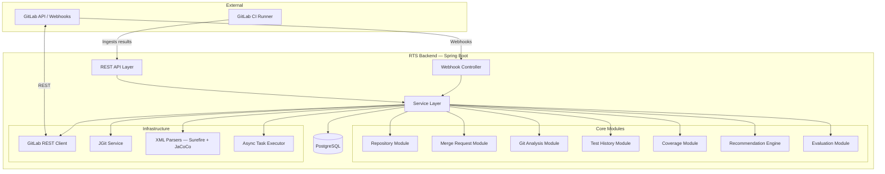
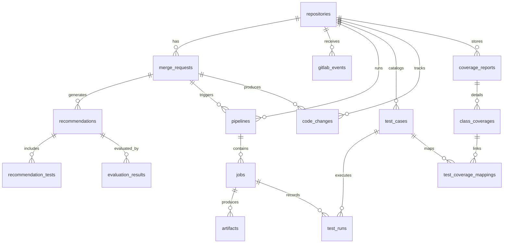

# AI-Powered Regression Test Selector (RTS) — Backend Implementation Plan

## Current State

The project at [`rts-backend`](file:///d:/Project/RTS/rts-backend) is a freshly scaffolded Spring Boot 4.1.1 / Java 21 / Gradle Kotlin DSL project with:
- Spring Web, Validation, Actuator, Data JDBC, Flyway, PostgreSQL driver, DevTools
- Empty Flyway migration folder, default `application.properties`
- Single [`RtsBackendApplication.java`](file:///d:/Project/RTS/rts-backend/src/main/java/com/rts/rts_backend/RtsBackendApplication.java) entry point

> [!NOTE]
> The generated package is `com.rts.rts_backend` (Spring Initializr auto-replaced the hyphen). We will keep this as-is — renaming to `com.rts.backend` would be cleaner but is cosmetic and can be done later.

---

## Architecture Overview



---

## Package Structure

All under `com.rts.rts_backend`:

```
com.rts.rts_backend
├── config/                    # Spring config beans, async config, web config
│   ├── AsyncConfig.java
│   ├── WebConfig.java
│   ├── JacksonConfig.java
│   └── SecurityConfig.java       # API-key / token filter
│
├── common/                    # Cross-cutting concerns
│   ├── exception/
│   │   ├── GlobalExceptionHandler.java
│   │   ├── ApiError.java
│   │   ├── ResourceNotFoundException.java
│   │   ├── GitLabConnectionException.java
│   │   └── DuplicateEventException.java
│   ├── web/
│   │   ├── RequestIdFilter.java
│   │   └── ApiResponse.java
│   └── util/
│       ├── IdGenerator.java       # UUID / TSID
│       └── TimeUtils.java
│
├── repository/                # "Repository" domain (GitLab project)
│   ├── controller/
│   │   └── RepositoryController.java
│   ├── service/
│   │   ├── RepositoryService.java
│   │   └── RepositoryServiceImpl.java
│   ├── model/
│   │   ├── Repository.java            # domain/entity
│   │   ├── ConnectionStatus.java      # enum
│   │   └── BuildSystem.java           # enum MAVEN/GRADLE
│   ├── dto/
│   │   ├── CreateRepositoryRequest.java
│   │   ├── UpdateRepositoryRequest.java
│   │   ├── RepositoryResponse.java
│   │   └── ValidationResult.java
│   └── dao/
│       └── RepositoryDao.java         # Spring JDBC
│
├── gitlab/                    # GitLab integration
│   ├── client/
│   │   ├── GitLabClient.java          # interface
│   │   └── GitLabRestClient.java      # RestClient impl
│   ├── webhook/
│   │   ├── WebhookController.java
│   │   ├── WebhookService.java
│   │   ├── WebhookEventProcessor.java
│   │   └── WebhookSecretFilter.java
│   ├── model/
│   │   ├── GitLabProject.java
│   │   ├── GitLabMergeRequestEvent.java
│   │   ├── GitLabPipelineEvent.java
│   │   └── GitLabJobArtifact.java
│   └── dao/
│       └── GitLabEventDao.java
│
├── mergerequest/              # Merge request domain
│   ├── controller/
│   │   └── MergeRequestController.java
│   ├── service/
│   │   ├── MergeRequestService.java
│   │   └── MergeRequestServiceImpl.java
│   ├── model/
│   │   ├── MergeRequest.java
│   │   └── MergeRequestState.java
│   ├── dto/
│   │   ├── MergeRequestResponse.java
│   │   └── MergeRequestDetailResponse.java
│   └── dao/
│       └── MergeRequestDao.java
│
├── analysis/                  # Git diff + code analysis
│   ├── service/
│   │   ├── GitAnalysisService.java
│   │   ├── DiffAnalyzer.java
│   │   └── JavaAstAnalyzer.java       # JavaParser
│   ├── model/
│   │   ├── CodeChange.java
│   │   ├── ChangedFile.java
│   │   ├── ChangedClass.java
│   │   └── ChangedMethod.java
│   └── dao/
│       └── CodeChangeDao.java
│
├── testhistory/               # Test catalog + run history
│   ├── controller/
│   │   └── TestHistoryController.java
│   ├── service/
│   │   ├── TestIngestionService.java
│   │   ├── SurefireXmlParser.java
│   │   ├── GradleTestXmlParser.java
│   │   └── TestStatisticsService.java
│   ├── model/
│   │   ├── TestCase.java
│   │   ├── TestRun.java
│   │   ├── TestResult.java
│   │   └── TestStatistics.java
│   ├── dto/
│   │   ├── TestIngestionRequest.java
│   │   └── TestCaseResponse.java
│   └── dao/
│       ├── TestCaseDao.java
│       └── TestRunDao.java
│
├── coverage/                  # JaCoCo coverage
│   ├── service/
│   │   ├── CoverageIngestionService.java
│   │   └── JacocoXmlParser.java
│   ├── model/
│   │   ├── CoverageReport.java
│   │   └── ClassCoverage.java
│   └── dao/
│       └── CoverageDao.java
│
├── recommendation/            # Core AI / heuristic engine
│   ├── controller/
│   │   └── RecommendationController.java
│   ├── service/
│   │   ├── RecommendationService.java
│   │   ├── FeatureBuilder.java
│   │   ├── HeuristicScorer.java
│   │   ├── SelectionPolicy.java       # interface
│   │   ├── SafeSelectionPolicy.java
│   │   ├── RecallFocusedPolicy.java
│   │   └── SpeedFocusedPolicy.java
│   ├── model/
│   │   ├── Recommendation.java
│   │   ├── TestScore.java
│   │   ├── SelectionMode.java         # enum
│   │   └── Explanation.java
│   ├── dto/
│   │   ├── RecommendationResponse.java
│   │   ├── TestScoreResponse.java
│   │   ├── ExplanationResponse.java
│   │   └── ExportResponse.java
│   └── dao/
│       └── RecommendationDao.java
│
├── pipeline/                  # GitLab pipeline + job tracking
│   ├── controller/
│   │   └── PipelineController.java
│   ├── service/
│   │   ├── PipelineService.java
│   │   └── ArtifactIngestionService.java
│   ├── model/
│   │   ├── Pipeline.java
│   │   ├── Job.java
│   │   ├── Artifact.java
│   │   └── PipelineStatus.java
│   ├── dto/
│   │   └── PipelineResponse.java
│   └── dao/
│       ├── PipelineDao.java
│       └── JobDao.java
│
├── evaluation/                # Recall / reduction analytics
│   ├── controller/
│   │   └── AnalyticsController.java
│   ├── service/
│   │   ├── EvaluationService.java
│   │   └── AnalyticsAggregator.java
│   ├── model/
│   │   └── EvaluationResult.java
│   ├── dto/
│   │   ├── AnalyticsSummary.java
│   │   ├── TrendResponse.java
│   │   └── RecallReport.java
│   └── dao/
│       └── EvaluationDao.java
│
└── ingestion/                 # Unified ingestion APIs
    ├── controller/
    │   └── IngestionController.java
    ├── service/
    │   └── IngestionOrchestrator.java
    ├── model/
    │   ├── Ingestion.java
    │   └── IngestionStatus.java
    └── dao/
        └── IngestionDao.java
```

---

## Database Design

### ER Diagram



### Migration Plan (Flyway)

| Migration | Tables | Phase |
|---|---|---|
| `V1__create_repositories.sql` | `repositories` | 1 |
| `V2__create_gitlab_events.sql` | `gitlab_events` | 1 |
| `V3__create_merge_requests.sql` | `merge_requests` | 3 |
| `V4__create_code_changes.sql` | `code_changes`, `changed_files`, `changed_classes`, `changed_methods` | 4 |
| `V5__create_test_catalog.sql` | `test_cases`, `test_runs` | 5 |
| `V6__create_coverage.sql` | `coverage_reports`, `class_coverages`, `test_coverage_mappings` | 6 |
| `V7__create_recommendations.sql` | `recommendations`, `recommendation_tests` | 7 |
| `V8__create_pipelines.sql` | `pipelines`, `jobs`, `artifacts` | 8 |
| `V9__create_evaluations.sql` | `evaluation_results` | 9 |
| `V10__create_ingestions.sql` | `ingestions`, `ingestion_errors` | 5 |

### Key Table Schemas

#### `repositories`
```sql
CREATE TABLE repositories (
    id              UUID PRIMARY KEY,
    name            VARCHAR(255) NOT NULL,
    gitlab_base_url VARCHAR(512) NOT NULL,
    gitlab_project_id BIGINT NOT NULL,
    gitlab_project_path VARCHAR(512),
    default_branch  VARCHAR(255) DEFAULT 'main',
    build_system    VARCHAR(20) NOT NULL,          -- MAVEN, GRADLE
    test_framework  VARCHAR(20) DEFAULT 'JUNIT5',
    access_token_encrypted BYTEA,
    webhook_secret_hash VARCHAR(128),
    connection_status VARCHAR(20) DEFAULT 'PENDING',
    last_synced_at  TIMESTAMPTZ,
    created_at      TIMESTAMPTZ NOT NULL DEFAULT NOW(),
    updated_at      TIMESTAMPTZ NOT NULL DEFAULT NOW(),
    UNIQUE(gitlab_base_url, gitlab_project_id)
);
```

#### `merge_requests`
```sql
CREATE TABLE merge_requests (
    id                  UUID PRIMARY KEY,
    repository_id       UUID NOT NULL REFERENCES repositories(id),
    gitlab_iid          INTEGER NOT NULL,
    title               VARCHAR(1000),
    source_branch       VARCHAR(255) NOT NULL,
    target_branch       VARCHAR(255) NOT NULL,
    source_commit_sha   VARCHAR(40),
    target_commit_sha   VARCHAR(40),
    author_username     VARCHAR(255),
    state               VARCHAR(20) NOT NULL,      -- OPENED, CLOSED, MERGED
    web_url             VARCHAR(1024),
    created_at          TIMESTAMPTZ NOT NULL DEFAULT NOW(),
    updated_at          TIMESTAMPTZ NOT NULL DEFAULT NOW(),
    UNIQUE(repository_id, gitlab_iid)
);
```

#### `test_cases`
```sql
CREATE TABLE test_cases (
    id              UUID PRIMARY KEY,
    repository_id   UUID NOT NULL REFERENCES repositories(id),
    class_name      VARCHAR(512) NOT NULL,
    method_name     VARCHAR(512) NOT NULL,
    package_name    VARCHAR(512),
    test_type       VARCHAR(20) DEFAULT 'UNIT',    -- UNIT, INTEGRATION, E2E
    tags            TEXT[],
    avg_duration_ms INTEGER,
    failure_rate    DOUBLE PRECISION DEFAULT 0,
    flakiness_score DOUBLE PRECISION DEFAULT 0,
    last_run_at     TIMESTAMPTZ,
    first_seen_at   TIMESTAMPTZ NOT NULL DEFAULT NOW(),
    UNIQUE(repository_id, class_name, method_name)
);
```

#### `recommendations`
```sql
CREATE TABLE recommendations (
    id                  UUID PRIMARY KEY,
    repository_id       UUID NOT NULL REFERENCES repositories(id),
    merge_request_id    UUID REFERENCES merge_requests(id),
    commit_sha          VARCHAR(40),
    selection_mode      VARCHAR(20) NOT NULL,       -- SAFE, RECALL, SPEED
    total_tests         INTEGER NOT NULL,
    selected_tests      INTEGER NOT NULL,
    estimated_duration_ms BIGINT,
    confidence_score    DOUBLE PRECISION,
    model_version       VARCHAR(50),
    maven_selector      TEXT,
    gradle_selector     TEXT,
    status              VARCHAR(20) DEFAULT 'CREATED',
    created_at          TIMESTAMPTZ NOT NULL DEFAULT NOW()
);
```

> [!IMPORTANT]
> Access tokens are stored encrypted (AES-256-GCM via a server-side key). Webhook secrets are stored as bcrypt hashes. Tokens are **never** returned in API responses.

---

## Phase-by-Phase Implementation

### Phase 1: Spring Foundation (Sprint 1 — ~3 days)

**Goal**: Bootable application with PostgreSQL, Flyway, error handling, observability, and API documentation.

#### Files to create/modify:

| Action | File | Purpose |
|--------|------|---------|
| MODIFY | [`build.gradle.kts`](file:///d:/Project/RTS/rts-backend/build.gradle.kts) | Add SpringDoc OpenAPI, Jackson JSR-310, Testcontainers, AssertJ, Mockito, docker-compose support |
| NEW | `docker-compose.yml` | PostgreSQL 16 container |
| MODIFY | `application.properties` → `application.yml` | Structured config with profiles (dev, test, prod) |
| NEW | `application-dev.yml` | Dev datasource, logging, flyway config |
| NEW | `application-test.yml` | Testcontainers-based config |
| NEW | `V1__create_repositories.sql` | First migration |
| NEW | `V2__create_gitlab_events.sql` | Event dedup table |
| NEW | `config/AsyncConfig.java` | Thread pool for async analysis |
| NEW | `config/WebConfig.java` | CORS (for future UI), content negotiation |
| NEW | `config/JacksonConfig.java` | ISO-8601 dates, snake_case → camelCase |
| NEW | `common/exception/GlobalExceptionHandler.java` | `@RestControllerAdvice`, unified error envelope |
| NEW | `common/exception/ApiError.java` | `{ requestId, status, code, message, details[], timestamp }` |
| NEW | `common/exception/ResourceNotFoundException.java` | 404 |
| NEW | `common/web/RequestIdFilter.java` | MDC-based request ID in every log + response header |
| NEW | `common/web/ApiResponse.java` | Generic `{ data, meta }` wrapper |

**Verification**: `./gradlew bootRun` starts, health endpoint returns UP, Flyway creates tables, OpenAPI at `/swagger-ui.html`.

---

### Phase 2: Repository Management + GitLab Connection (Sprint 1–2 — ~4 days)

**Goal**: CRUD for repositories, GitLab token validation, permission checking.

| Action | File | Purpose |
|--------|------|---------|
| NEW | `repository/model/Repository.java` | Domain entity |
| NEW | `repository/model/ConnectionStatus.java` | `PENDING`, `CONNECTED`, `FAILED`, `DISCONNECTED` |
| NEW | `repository/model/BuildSystem.java` | `MAVEN`, `GRADLE` |
| NEW | `repository/dao/RepositoryDao.java` | Spring JDBC `NamedParameterJdbcTemplate` |
| NEW | `repository/dto/CreateRepositoryRequest.java` | `record` with `@Valid` |
| NEW | `repository/dto/UpdateRepositoryRequest.java` | Partial update |
| NEW | `repository/dto/RepositoryResponse.java` | **Never** includes token |
| NEW | `repository/dto/ValidationResult.java` | Permission checks result |
| NEW | `repository/service/RepositoryService.java` | Interface |
| NEW | `repository/service/RepositoryServiceImpl.java` | CRUD + validate |
| NEW | `repository/controller/RepositoryController.java` | REST endpoints |
| NEW | `gitlab/client/GitLabClient.java` | Interface for all GitLab calls |
| NEW | `gitlab/client/GitLabRestClient.java` | Spring `RestClient` impl, retry logic |
| NEW | `gitlab/model/GitLabProject.java` | Mapped from GitLab `/projects/:id` |
| NEW | `config/SecurityConfig.java` | API-key filter (simple for v1) |

**Key API Endpoints**:
```
POST   /api/v1/repositories                         — Register a GitLab project
GET    /api/v1/repositories                          — List all
GET    /api/v1/repositories/{id}                     — Get by ID
PATCH  /api/v1/repositories/{id}                     — Update
DELETE /api/v1/repositories/{id}                     — Soft-delete
POST   /api/v1/repositories/{id}/validate            — Validate GitLab connection
POST   /api/v1/repositories/{id}/sync                — Sync project metadata
```

**Verification**: Register a real GitLab project, validate connection, see permission results.

---

### Phase 3: Merge Request Integration + Webhooks (Sprint 2 — ~5 days)

**Goal**: Receive GitLab merge-request webhooks, store MR metadata, trigger async analysis.

| Action | File | Purpose |
|--------|------|---------|
| NEW | `V3__create_merge_requests.sql` | MR table |
| NEW | `mergerequest/model/*` | MR entity + state enum |
| NEW | `mergerequest/dao/MergeRequestDao.java` | JDBC queries |
| NEW | `mergerequest/dto/*` | Response DTOs |
| NEW | `mergerequest/service/*` | MR sync + list/detail |
| NEW | `mergerequest/controller/MergeRequestController.java` | MR APIs |
| NEW | `gitlab/webhook/WebhookController.java` | `POST /api/v1/webhooks/gitlab` |
| NEW | `gitlab/webhook/WebhookService.java` | Event parsing + dedup |
| NEW | `gitlab/webhook/WebhookEventProcessor.java` | Async event handler |
| NEW | `gitlab/model/GitLabMergeRequestEvent.java` | Webhook payload mapping |
| NEW | `gitlab/dao/GitLabEventDao.java` | Event dedup storage |

**Key behaviors**:
- Verify `X-Gitlab-Token` header against stored webhook secret
- Compute `payload_hash` (SHA-256 of event key fields) to prevent duplicate processing
- Return `200 OK` immediately; heavy work runs `@Async`
- Event state machine: `RECEIVED → VALIDATED → QUEUED → PROCESSING → COMPLETED/FAILED`

**Verification**: Configure webhook on a test GitLab project, open MR, see event stored and MR listed via API.

---

### Phase 4: Git Diff + Code Analysis (Sprint 3 — ~5 days)

**Goal**: Clone/fetch repo, compute diff between target and source branches, extract changed Java files/classes/methods.

| Action | File | Purpose |
|--------|------|---------|
| NEW | Add `org.eclipse.jgit` + `com.github.javaparser` to `build.gradle.kts` | Git + AST |
| NEW | `V4__create_code_changes.sql` | Code-change tables |
| NEW | `analysis/service/GitAnalysisService.java` | JGit clone/fetch + diff |
| NEW | `analysis/service/DiffAnalyzer.java` | Parse unified diff → changed files/lines |
| NEW | `analysis/service/JavaAstAnalyzer.java` | JavaParser → changed classes + methods |
| NEW | `analysis/model/*` | `CodeChange`, `ChangedFile`, `ChangedClass`, `ChangedMethod` |
| NEW | `analysis/dao/CodeChangeDao.java` | Persist changes |

**Key design decisions**:
- **JGit bare clone** cached per repository in a configurable local path (e.g., `/var/rts/repos/{id}`)
- On webhook: `git fetch` + compute diff between `target_commit_sha..source_commit_sha`
- JavaParser analyzes only `.java` files from the diff to extract class-level and method-level changes
- Results stored per `merge_request_id` + `commit_sha` pair

**Verification**: Trigger analysis on a real MR, verify changed files/classes/methods match GitLab diff view.

---

### Phase 5: Test History Ingestion (Sprint 3–4 — ~5 days)

**Goal**: Parse JUnit/Surefire XML reports, build test catalog, compute statistics.

| Action | File | Purpose |
|--------|------|---------|
| NEW | `V5__create_test_catalog.sql` | `test_cases`, `test_runs` |
| NEW | `V10__create_ingestions.sql` | `ingestions`, `ingestion_errors` |
| NEW | `testhistory/service/SurefireXmlParser.java` | Parse `TEST-*.xml` |
| NEW | `testhistory/service/GradleTestXmlParser.java` | Parse Gradle test XML (same schema, different paths) |
| NEW | `testhistory/service/TestIngestionService.java` | Orchestrate ingestion |
| NEW | `testhistory/service/TestStatisticsService.java` | Calculate failure rate, flakiness, avg duration |
| NEW | `testhistory/model/*` | `TestCase`, `TestRun`, `TestResult` |
| NEW | `testhistory/dao/*` | JDBC DAOs |
| NEW | `testhistory/controller/TestHistoryController.java` | Test catalog + stats API |
| NEW | `ingestion/controller/IngestionController.java` | Upload endpoint |
| NEW | `ingestion/service/IngestionOrchestrator.java` | Coordinate test + coverage ingestion |

**Key formulas**:
- `failure_rate = failed_runs / total_runs` (over last N runs, configurable window)
- `flakiness_score = transitions / (total_runs - 1)` where a "transition" = result changed from previous run
- Statistics recomputed on each new ingestion

**Verification**: Upload sample Surefire XML, verify test catalog populated, stats computed correctly.

---

### Phase 6: JaCoCo Coverage Ingestion (Sprint 4 — ~3 days)

**Goal**: Parse JaCoCo XML, store class-level coverage, map tests → production classes.

| Action | File | Purpose |
|--------|------|---------|
| NEW | `V6__create_coverage.sql` | Coverage tables |
| NEW | `coverage/service/JacocoXmlParser.java` | Parse `jacoco.xml` |
| NEW | `coverage/service/CoverageIngestionService.java` | Store + associate with commit |
| NEW | `coverage/model/*` | `CoverageReport`, `ClassCoverage` |
| NEW | `coverage/dao/CoverageDao.java` | JDBC |

**Design note**: JaCoCo per-class coverage establishes the **test → production class** mapping critical for the recommendation engine. Combined with the code-change analysis (Phase 4), this lets us answer: "which tests exercise the code that changed in this MR?"

**Verification**: Upload real JaCoCo report, verify coverage persisted, query coverage for a changed class.

---

### Phase 7: Recommendation Engine (Sprint 4–5 — ~7 days)

**Goal**: The core product — score every test for a given MR and produce a ranked, selected set.

| Action | File | Purpose |
|--------|------|---------|
| NEW | `V7__create_recommendations.sql` | Recommendations + selected tests |
| NEW | `recommendation/service/FeatureBuilder.java` | Construct feature vector per test |
| NEW | `recommendation/service/HeuristicScorer.java` | Rule-based scoring (pre-ML) |
| NEW | `recommendation/service/SelectionPolicy.java` | Interface |
| NEW | `recommendation/service/SafeSelectionPolicy.java` | High recall (~95%), moderate reduction |
| NEW | `recommendation/service/RecallFocusedPolicy.java` | Max recall, minimal reduction |
| NEW | `recommendation/service/SpeedFocusedPolicy.java` | Aggressive reduction, ~85% recall target |
| NEW | `recommendation/service/RecommendationService.java` | Orchestrate: features → score → select → persist |
| NEW | `recommendation/model/*` | `Recommendation`, `TestScore`, `SelectionMode`, `Explanation` |
| NEW | `recommendation/dto/*` | Response DTOs |
| NEW | `recommendation/controller/RecommendationController.java` | REST API |
| NEW | `recommendation/dao/RecommendationDao.java` | JDBC |

**Heuristic scoring algorithm (v1, pre-ML)**:

```
score(test, MR) =
    w1 × coverage_overlap(test, changed_classes)       // 0.0–1.0
  + w2 × package_proximity(test, changed_packages)     // 0.0–1.0
  + w3 × historical_failure_rate(test)                 // 0.0–1.0
  + w4 × flakiness_penalty(test)                       // -0.2–0.0
  + w5 × recency_boost(test, last_failure)             // 0.0–0.5
  + w6 × critical_tag_boost(test)                      // 0.0 or 1.0
```

Default weights: `w1=0.35, w2=0.20, w3=0.20, w4=0.05, w5=0.10, w6=0.10` (configurable).

**Selection policies**:
| Mode | Max duration | Min recall target | Strategy |
|------|-------------|-------------------|----------|
| SAFE | 80% of full suite time | 95% | Include all tests with score > 0.1 |
| RECALL | No limit | 99% | Include all tests with score > 0.01 |
| SPEED | 30% of full suite time | 85% | Top-N tests by score within time budget |

**Explanation generation**: For each selected/excluded test, produce a human-readable reason (e.g., "Selected: covers 3 changed classes, failed 2 of last 5 runs", "Excluded: no coverage overlap, 100% pass rate in last 50 runs").

**Output formats**:
- JSON recommendation response
- Maven `-Dtest=` selector string
- Gradle `--tests` selector string

**Verification**: Run recommendation on a real MR with test history + coverage data, verify scores are sensible, Maven/Gradle selectors are syntactically valid.

---

### Phase 8: Pipeline + Job Tracking + CI Integration (Sprint 5–6 — ~5 days)

**Goal**: Track GitLab pipelines, ingest CI results back, close the feedback loop.

| Action | File | Purpose |
|--------|------|---------|
| NEW | `V8__create_pipelines.sql` | Pipelines, jobs, artifacts |
| NEW | `pipeline/service/PipelineService.java` | Track pipeline lifecycle |
| NEW | `pipeline/service/ArtifactIngestionService.java` | Download + parse JUnit/JaCoCo artifacts from GitLab |
| NEW | `pipeline/model/*` | `Pipeline`, `Job`, `Artifact`, `PipelineStatus` |
| NEW | `pipeline/controller/PipelineController.java` | Pipeline APIs |
| NEW | `pipeline/dao/*` | JDBC |

**Auto-ingestion flow**: When a pipeline-complete webhook arrives:
1. Identify jobs with `artifacts:reports:junit`
2. Download artifacts via GitLab API
3. Parse and ingest test results (reuses Phase 5 parsers)
4. Update test statistics
5. Link results to the recommendation for evaluation

**Verification**: Run a GitLab pipeline with JUnit artifacts, verify auto-ingestion populates test history.

---

### Phase 9: Evaluation + Analytics (Sprint 6 — ~4 days)

**Goal**: Compare "selected tests" vs "full suite", compute recall, build analytics dashboards data.

| Action | File | Purpose |
|--------|------|---------|
| NEW | `V9__create_evaluations.sql` | Evaluation results |
| NEW | `evaluation/service/EvaluationService.java` | Compare selected vs full suite |
| NEW | `evaluation/service/AnalyticsAggregator.java` | Time-series aggregation |
| NEW | `evaluation/model/EvaluationResult.java` | Per-recommendation evaluation |
| NEW | `evaluation/controller/AnalyticsController.java` | Analytics APIs |
| NEW | `evaluation/dto/*` | Summary, trends, recall reports |
| NEW | `evaluation/dao/EvaluationDao.java` | JDBC |

**Metrics computed**:
- **Recall**: `failures_caught_by_selected / total_failures` (per MR, rolling average)
- **Test reduction**: `1 - (selected_count / total_count)` 
- **Time reduction**: `1 - (selected_duration / full_suite_duration)`
- **Missed regressions**: Tests that failed in full suite but were NOT in the selected set (critical for trust)
- **Flaky test tracking**: Tests that flip pass/fail without code changes

**Verification**: After a full-suite run + selected run on the same MR, verify recall and reduction metrics are computed correctly.

---

### Phase 10: ML Integration (Sprint 7+ — ~5 days)

**Goal**: Replace heuristic scorer with a trained ML model for better accuracy.

| Action | File | Purpose |
|--------|------|---------|
| NEW | `recommendation/ml/FeatureExporter.java` | Export training data as CSV/Parquet |
| NEW | `recommendation/ml/OnnxModelService.java` | Load + run ONNX model |
| NEW | `recommendation/ml/ModelRegistry.java` | Track model versions |
| NEW | Python training scripts (separate repo/directory) | LightGBM / XGBoost training |

**Training pipeline** (Python, offline):
1. Export feature vectors from PostgreSQL (FeatureExporter)
2. Train LightGBM binary classifier: `P(test fails | features)`
3. Time-based train/test split (no future leakage)
4. Export to ONNX
5. Upload model file, register version in DB

**Inference** (Java, online):
1. Build features (same as heuristic, plus additional ML features)
2. Run ONNX model via `ai.onnxruntime` Java API
3. Fall back to heuristic scorer if model confidence < threshold

> [!NOTE]
> The heuristic scorer from Phase 7 is the baseline. The ML model must beat it on recall AND reduction before being promoted to production.

---

## UI-Readiness: Backend Design Decisions

Since the UI will be built later, the backend is designed to make it **trivially consumable** by any frontend:

| Concern | Backend provision |
|---------|------------------|
| **Consistent API envelope** | Every response: `{ data: T, meta: { requestId, timestamp } }` for success; `{ error: { code, message, details } }` for failure |
| **Pagination** | Cursor-based for lists: `?cursor=xxx&limit=20`, response includes `meta.nextCursor` |
| **Filtering/Sorting** | Query params: `?status=OPENED&author=alice&sort=createdAt,desc` |
| **Real-time updates** | SSE endpoint `GET /api/v1/events/stream?repositoryId=xxx` for analysis progress (Phase 3+) |
| **CORS** | Configurable allowed origins in `WebConfig` |
| **OpenAPI spec** | Auto-generated at `/v3/api-docs`, Swagger UI at `/swagger-ui.html` |
| **Dashboard-ready analytics** | Pre-aggregated time-series data for charts (daily/weekly/monthly) |
| **Linking to GitLab** | Every entity with a GitLab counterpart includes `webUrl` for deep-linking |
| **Status tracking** | Webhook events, analysis jobs, ingestions — all have status enums queryable via API |

---

## Additional Dependencies to Add

```kotlin
// build.gradle.kts — additions
dependencies {
    // OpenAPI documentation
    implementation("org.springdoc:springdoc-openapi-starter-webmvc-ui:2.8.6")
    
    // Git analysis
    implementation("org.eclipse.jgit:org.eclipse.jgit:7.2.0.202503040940-r")
    
    // Java AST parsing
    implementation("com.github.javaparser:javaparser-core:3.26.4")
    
    // JSON processing
    implementation("com.fasterxml.jackson.datatype:jackson-datatype-jsr310")
    implementation("com.fasterxml.jackson.dataformat:jackson-dataformat-xml")
    
    // Encryption for tokens
    implementation("org.bouncycastle:bcprov-jdk18on:1.80")
    
    // ONNX Runtime (Phase 10)
    // implementation("com.microsoft.onnxruntime:onnxruntime:1.21.0")
    
    // Testing
    testImplementation("org.assertj:assertj-core")
    testImplementation("org.mockito:mockito-core")
    testImplementation("org.testcontainers:postgresql")
    testImplementation("org.testcontainers:junit-jupiter")
}
```

---

## Docker Compose (Development)

```yaml
services:
  postgres:
    image: postgres:16-alpine
    ports:
      - "5432:5432"
    environment:
      POSTGRES_DB: rts
      POSTGRES_USER: rts
      POSTGRES_PASSWORD: rts_dev_password
    volumes:
      - pgdata:/var/lib/postgresql/data

volumes:
  pgdata:
```

---

## Configuration Structure (`application.yml`)

```yaml
spring:
  application:
    name: rts-backend
  datasource:
    url: jdbc:postgresql://localhost:5432/rts
    username: rts
    password: ${RTS_DB_PASSWORD:rts_dev_password}
  flyway:
    enabled: true
    locations: classpath:db/migration

rts:
  gitlab:
    connect-timeout: 5s
    read-timeout: 10s
    max-retries: 3
  analysis:
    repo-cache-dir: ${RTS_REPO_CACHE:/tmp/rts/repos}
    async-pool-size: 4
  recommendation:
    default-mode: SAFE
    weights:
      coverage-overlap: 0.35
      package-proximity: 0.20
      failure-rate: 0.20
      flakiness-penalty: 0.05
      recency-boost: 0.10
      critical-tag: 0.10
  security:
    encryption-key: ${RTS_ENCRYPTION_KEY}
    api-keys: ${RTS_API_KEYS:}

management:
  endpoints:
    web:
      exposure:
        include: health,info,metrics,prometheus
```

---

## Verification Plan

### Automated Tests (per phase)

| Phase | Test Type | What |
|-------|-----------|------|
| 1 | Integration | App context loads, Flyway runs, health endpoint UP |
| 2 | Unit + Integration | Repository CRUD, GitLab validation (mocked client) |
| 3 | Unit + Integration | Webhook parsing, dedup, MR persistence |
| 4 | Unit | Diff parsing, JavaParser class/method extraction |
| 5 | Unit | Surefire XML parsing, statistics calculation |
| 6 | Unit | JaCoCo XML parsing |
| 7 | Unit + Integration | Feature building, scoring, selection policy, selector generation |
| 8 | Integration | Pipeline tracking, artifact ingestion |
| 9 | Unit | Recall/reduction calculation |
| 10 | Integration | ONNX model loading + inference |

**Run all**: `./gradlew test`

### Manual Verification

- Register a real GitLab project and validate the connection
- Configure webhook and open a merge request → verify async analysis
- Upload real Surefire/JaCoCo XML → verify ingestion
- Trigger recommendation → verify Maven/Gradle selectors work
- Run GitLab CI pipeline with generated selectors → verify tests execute correctly

---

## Open Questions

> [!IMPORTANT]
> **1. Package naming**: The Spring Initializr generated `com.rts.rts_backend`. Should we refactor to `com.rts.backend` now, or keep as-is to avoid regeneration complexity?

> [!IMPORTANT]
> **2. Token encryption**: For v1 development, should we use simple AES encryption with a config-based key, or integrate with a secrets manager (e.g., HashiCorp Vault) from the start?

> [!IMPORTANT]
> **3. Git clone strategy**: Should the backend clone repositories to local disk (faster, needs disk space + cleanup) or always fetch via GitLab API (slower, zero disk usage)? Recommendation: local clone with a configurable cache eviction policy.

> [!IMPORTANT]  
> **4. Async framework**: Should webhook processing use Spring `@Async` with a simple thread pool, or should we add a proper task queue (e.g., PostgreSQL-backed queue via `pg_notify` or a library like Jobrunr) for reliability and retry?

> [!IMPORTANT]
> **5. Multi-module Maven/Gradle projects**: Should v1 support multi-module builds (more complex selector generation) or assume single-module?

> [!IMPORTANT]
> **6. Execution order**: The plan above follows your phased approach. Should I start with **Phase 1 + 2** (foundation + repository management) as the first sprint, or do you want a different ordering?
